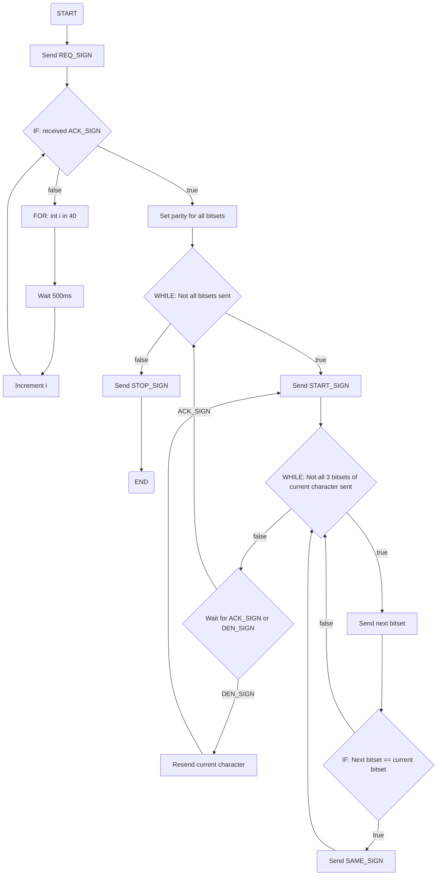
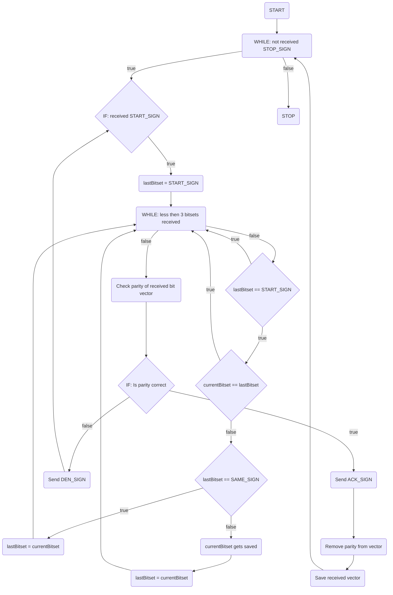

# 8-Bit-Kommunikationssystem

---





Dieses Projekt war Teil des Moduls "Hardwarepraktikum II (C405)" meines Bachelorstudiums an
der [HTWK Leipzig](https://htwk-leipzig.de). Im Wintersemester 2023/24 habe ich in Zusammenarbeit mit meinem
Kommilitonen Quentin Kleinert 8eine Binäruhr auf Basis des ATmega48A Mikrocontrollers entwickelt. Dies war einer von
insgesamt vier praktischen Prüfungen des Kurses.

## Ziele des Projekts

Das Hauptziel des Projektes war es, ein eigenes Kommunikationsprotokoll zu entwerfen und zu implementieren, das Daten
über ein Patchkabel zwischen zwei B15-Boards überträgt. Dabei sollten wir uns mit den Grundlagen der OSI-Schichten 1 und
2 vertraut machen und erste Erfahrungen im Umgang mit elektrischer Messtechnik sammeln.

**Konkrete Aufgaben**

- Full-Duplex-Kommunikation: Beide Boards sollten gleichzeitig senden und empfangen können.
- Fehlererkennung und -korrektur: Implementierung eines ARQ-Protokolls, um fehlerhafte Datenpakete erneut anzufordern.
- Datenübertragung: Übertragung von Textzeilen und großen Dateien (bis zu 1 GB) mit Prüfsummen und Paritätsbits.
- Geschwindigkeitstests: Vergleich der Übertragungsgeschwindigkeit mit Standard-Tools wie scp.

## Technische Grundlagen

### Das B15-Board



Das B15-Board ist ein Datenerfassungsboard (DAQ), das an der HTWK Leipzig entwickelt wurde. Es zeichnet sich durch seine
einfache Programmierung und offene Dokumentation aus. Für unser Projekt nutzten wir die PortA-Schnittstelle, um Daten
über ein Patchkabel zu senden und zu empfangen.

### Paketaufbau und Steuerbits



Unser Protokoll basierte auf einer Aufteilung von 4 Bits in ein Steuerungs-Bit und 3-Datenbits. Das Steuerungs-Bit (MSB)
bestimmt die Art des Pakets, während die 3 Datenbits die eigentlichen Informationen enthalten. Wenn das Steuerungs-Bit
auf `0` gesetzt ist, handelt es sich um ein Datenpaket. Andernfalls wird ein Steuerpaket übertragen. Folgende Steuerbits
wurden definiert:

| Steuerbit | Zeichen      | Erklärung                                                                         |
|-----------|--------------|-----------------------------------------------------------------------------------|
| `1000`    | `START_SIGN` | Die Übertragung starten                                                           |
| `1001`    | `DEN_SIGN`   | Die Übertragung wurde abgelehnt (Denial)                                          |
| `1010`    | `SAME_SIGN`  | Trennzeichen, welches gesendet wird, wenn zwei gleiche Zeichen aufeinander folgen |
| `1011`    | `ACK_SIGN`   | Die Übertragung wurde angenommen (Acknowledgement)                                |
| `1100`    | `REQ_SIGN`   | Es wird von einer Seite Angefragt, ob die Übertragung starten kann                |
| `1111`    | `STOP_SIGN`  | Die Übertragung ist beendet                                                       |

### Leitungsarchitektur



Die Leitung ist so aufgebaut, dass der Sendene-PC auf den ersten vier Bits der PortA-Schnittstelle die Daten
überträgt und auf den letzten vier Bits Daten empfängt. Der empfangende PC funktioniert genau umgekehrt. Dies ermöglicht
eine
Full-Duplex-Kommunikation ohne dass sich die Datenpakete gegenseitig stören.

## Programmablauf

### Sendeprogramm

1. **Anfrage**: Das Sendeprogramm beginnt mit dem Senden eines `REQ_SIGN`, um die Bereitschaft des Empfängers zu
   überprüfen.
2. **Warten auf Bestätigung**: Es wird auf ein `ACK_SIGN` gewartet, um sicherzustellen, dass der Empfänger bereit ist.
3. **Startzeichen senden**: Das Sendeprogramm beginnt mit dem Senden eines `START_SIGN`.
4. **Pakete versenden**: Die Daten werden in 3-Bit-Pakete aufgeteilt und nacheinander gesendet.
5. **Bestätigung abwarten**: Nach jedem Paket wird auf ein `ACK_SIGN` (Bestätigung) oder `DEN_SIGN` (Ablehnung)
   gewartet.
6. **Fehlerbehandlung**: Bei einer Ablehnung wird das Paket erneut gesendet.
7. **Stopzeichen senden**: Am Ende der Übertragung wird ein `STOP_SIGN` gesendet.

#### Flowchart Sendeprogramm

### Empfangsprogramm

1. **Auf Anfrage warten**: Das Empfangsprogramm beginnt mit dem Warten auf ein `REQ_SIGN`.
2. **Bestätigung senden**: Nach Empfang eines `REQ_SIGN` wird ein `ACK_SIGN` gesendet, um die Bereitschaft zu
   signalisieren.
3. **Auf Startzeichen warten**: Das Empfangsprogramm wartet auf ein `START_SIGN`.
4. **Pakete empfangen**: Die empfangenen Pakete werden gesammelt und auf Fehler überprüft.
5. **Parität prüfen**: Die Prüfsumme wird berechnet und mit dem Paritätsbit verglichen.
6. **Bestätigung senden**: Bei korrekter Übertragung wird ein `ACK_SIGN` gesendet, andernfalls ein `DEN_SIGN`.
7. **Daten rekonstruieren**: Die empfangenen Pakete werden zu Bytes zusammengesetzt und ausgegeben.

#### Flowchart Empfangsprogramm

## Ergebnisse

Um auch eine VErlgeichsgröße zu haben, sollten wir verschieden große Dateien übertragen und die Übertragungszeit messen.
Hier sind die Ergebnisse:

| Dateigröße          | Übertragungszeit | Übertragungszeit eines Bits | Bitrate     |
|---------------------|------------------|-----------------------------|-------------|
| 10 Byte (80 Bit)    | 4,92557 Sekunden | 0,062 Sekunden              | 16,24 Bit/s |
| 25 Byte (200 Bit)   | 10,7115 Sekunden | 0,054 Sekunden              | 18,67 Bit/s |
| 50 Byte (400 Bit)   | 20,7858 Sekunden | 0,052 Sekunden              | 19,24 Bit/s |
| 100 Byte (800 Bit)  | 41,3637 Sekunden | 0,051 Sekunden              | 19,34 Bit/s |
| 200 Byte (1600 Bit) | 82,2825 Sekunden | 0,051Sekunden               | 19,44 Bit/s |

Die Geschwindigkeit war aufgrund der manuellen Fehlerkorrektur und der begrenzten Bandbreite (4 Bit pro Richtung)
relativ niedrig – was aber auch nicht das Hauptziel war. Viel mehr ging es um Zuverlässigkeit und das Verständnis der
Grundlagen der Datenübertragung.